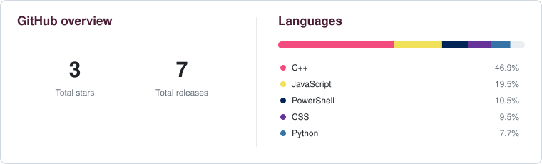

## Building now

<!-- building_now:start -->
<!-- building_now:end -->

## Recent releases

<!-- recent_releases:start -->
<!-- recent_releases:end -->

Recently updated repositories

<!-- recent_repositories:start -->
<!-- recent_repositories:end -->

