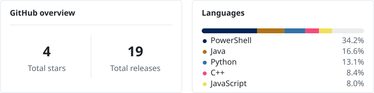

  

## Building now

<!-- building_now:start -->
- [**ck3-workshop-history**](https://github.com/Yusseter/ck3-workshop-history) — *No description.* 
  <blockquote>Updated 20 hours ago · <picture></picture>PowerShell</blockquote>
- [**tray-order-lock**](https://github.com/Yusseter/tray-order-lock) — Windhawk mod for locking Windows 11 notification-area icon order, with supporting analyzers and research. 
  <blockquote>Updated 4 days ago · <picture></picture>C++</blockquote>
<!-- building_now:end -->

## Recent releases

<!-- recent_releases:start -->
- [**CK3 Workshop Auto Updater v0.3.0**](https://github.com/Yusseter/ck3-workshop-auto-updater/releases/tag/v0.3.0)  
  <blockquote>Released this last week · [ v0.3.0](https://github.com/Yusseter/ck3-workshop-auto-updater/tree/v0.3.0)</blockquote>
- [**Tray Order Lock 0.1.0**](https://github.com/Yusseter/tray-order-lock/releases/tag/tray-order-lock-v0.1.0)  
  <blockquote>Released this 2 weeks ago · [ tray-order-lock-v0.1.0](https://github.com/Yusseter/tray-order-lock/tree/tray-order-lock-v0.1.0)</blockquote>
- [**CK3 Workshop Auto Updater v0.2.0**](https://github.com/Yusseter/ck3-workshop-auto-updater/releases/tag/v0.2.0)  
  <blockquote>Released this 2 weeks ago · [ v0.2.0](https://github.com/Yusseter/ck3-workshop-auto-updater/tree/v0.2.0)</blockquote>

More releases

- [**CK3 Workshop Auto Updater v0.1.1**](https://github.com/Yusseter/ck3-workshop-auto-updater/releases/tag/v0.1.1)  
  <blockquote>Released this 2 weeks ago · [ v0.1.1](https://github.com/Yusseter/ck3-workshop-auto-updater/tree/v0.1.1)</blockquote>
- [**CK3 Workshop Auto Updater v0.1.0**](https://github.com/Yusseter/ck3-workshop-auto-updater/releases/tag/v0.1.0)  
  <blockquote>Released this 2 weeks ago · [ v0.1.0](https://github.com/Yusseter/ck3-workshop-auto-updater/tree/v0.1.0)</blockquote>
- [**1.2.2 for 1.19 (Released: 2026-04-20)**](https://github.com/Yusseter/yb_map/releases/tag/1.2.2)  
  <blockquote>Released this Apr 20 · [ 1.2.2](https://github.com/Yusseter/yb_map/tree/1.2.2)</blockquote>
- [**1.2.1 for 1.18 (Released: 2026-03-13)**](https://github.com/Yusseter/yb_map/releases/tag/1.2.1) 
  <blockquote>Released this Mar 13 · [ 1.2.1](https://github.com/Yusseter/yb_map/tree/1.2.1)</blockquote>

<!-- recent_releases:end -->

## GitHub snapshot

<!-- snapshot:start -->

  <picture>
    <source media="(max-width: 600px)" srcset="./assets/profile/snapshot-mobile.svg">
    
  </picture>

<!-- snapshot:end -->

Recently updated repositories

<!-- recent_repositories:start -->
- [ck3-workshop-history](https://github.com/Yusseter/ck3-workshop-history) — No description. — 2026-08-16
- [dijital-cagda-deger-erozyonu](https://github.com/Yusseter/dijital-cagda-deger-erozyonu) — No description. — 2026-08-15
- [tray-order-lock](https://github.com/Yusseter/tray-order-lock) — Windhawk mod for locking Windows 11 notification-area icon order, with supporting analyzers and research. — 2026-08-13
- [ck3-workshop-auto-updater](https://github.com/Yusseter/ck3-workshop-auto-updater) — A Windows utility that detects and requests missing Crusader Kings III Steam Workshop updates. — 2026-08-07
- [energy-saver-power-plan-link](https://github.com/Yusseter/energy-saver-power-plan-link) — A Windhawk mod that links Windows 11 Energy Saver with the Power Saver power plan. — 2026-08-02
<!-- recent_repositories:end -->

