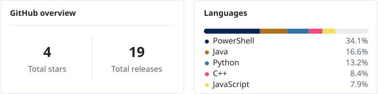

<!-- markdownlint-disable MD013 MD033 MD041 -->

  <picture>
    <source media="(max-width: 600px)" srcset="./assets/profile/header/mobile.svg">
    
  </picture>

## Building now

<!-- building_now:start -->
- [**Yusseter**](https://github.com/Yusseter/Yusseter) — Yusseter's profile repository. 
  <blockquote>Updated <relative-time datetime="2026-09-15T16:58:09Z">Sep 15, 2026</relative-time> · <a href="https://github.com/Yusseter?tab=repositories&amp;language=python"><picture><source media="(prefers-color-scheme: light) and (max-width: 600px)" srcset="./assets/profile/generated/languages/light/mobile/python.svg"><source media="(prefers-color-scheme: dark) and (max-width: 600px)" srcset="./assets/profile/generated/languages/dark/mobile/python.svg"><source media="(prefers-color-scheme: light)" srcset="./assets/profile/generated/languages/light/desktop/python.svg"><source media="(prefers-color-scheme: dark)" srcset="./assets/profile/generated/languages/dark/desktop/python.svg"></picture>Python</a></blockquote>
<!-- building_now:end -->

## Recent commits

<!-- recent_commits:start -->
- [**Yusseter**](https://github.com/Yusseter/Yusseter) — [Sync emblem updates across header SVG variants](https://github.com/Yusseter/Yusseter/commit/8b36d9ba68b696ee76e5c07fb1cae7d0ceebc185) 
  <blockquote>Committed <relative-time datetime="2026-09-15T16:58:09Z">Sep 15, 2026</relative-time> · [ 8b36d9b](https://github.com/Yusseter/Yusseter/commit/8b36d9ba68b696ee76e5c07fb1cae7d0ceebc185)</blockquote>
  

  
Details

  
Expand visual asset syncing from a single `profile/header/desktop.svg` file to all SVG variants in `assets/profile/header/`. The workflow now watches and stages the entire header directory, and `update_visual_assets.py` discovers header SVGs dynamically, validates at least one exists, and applies embedded logo/background synchronization to each file. The assets README was updated to clarify this synchronization behavior.

  

- [**Yusseter**](https://github.com/Yusseter/Yusseter) — [Rename profile config and fix hybrid asset path](https://github.com/Yusseter/Yusseter/commit/21a71a70a80a428149876e1030a6341c8c32457e) 
  <blockquote>Committed <relative-time datetime="2026-09-15T16:31:16Z">Sep 15, 2026</relative-time> · [ 21a71a7](https://github.com/Yusseter/Yusseter/commit/21a71a70a80a428149876e1030a6341c8c32457e)</blockquote>
  

  
Details

  
Rename `profile_renderer.json` to `profile_config.json` and update workflow triggers, config loading, validation messages, and tests to use the new name. Fix the native table hybrid language dot asset path to reference the generated snapshot directory, and add regression coverage for the corrected rendered path.

  

- [**Yusseter**](https://github.com/Yusseter/Yusseter) — [Fix visual asset workflow header path](https://github.com/Yusseter/Yusseter/commit/ccf9c56b128268f462adb9d791a9aad72b5af2b9) 
  <blockquote>Committed <relative-time datetime="2026-09-15T16:13:01Z">Sep 15, 2026</relative-time> · [ ccf9c56](https://github.com/Yusseter/Yusseter/commit/ccf9c56b128268f462adb9d791a9aad72b5af2b9)</blockquote>
  

  
Details

  
Update the visual asset workflow to watch and stage `assets/profile/header/desktop.svg` instead of the old header path, keeping automated visual asset updates aligned with the reorganized profile asset hierarchy.

  

- [**Yusseter**](https://github.com/Yusseter/Yusseter) — [Reorganize profile asset hierarchy](https://github.com/Yusseter/Yusseter/commit/5a32d9496c58fb9fb167002511a369bfd9c8e614) 
  <blockquote>Committed <relative-time datetime="2026-09-15T15:54:49Z">Sep 15, 2026</relative-time> · [ 5a32d94](https://github.com/Yusseter/Yusseter/commit/5a32d9496c58fb9fb167002511a369bfd9c8e614)</blockquote>
  

  
Details

  
Restructure profile assets into clearer header, icon, and generated subdirectories, moving generated language SVGs into theme and viewport folders instead of encoding variants in filenames. Update README, renderer, visual asset, and profile updater references to the new paths, preserve existing asset contents during moves, add cleanup for empty generated directories, and expand tests for the new language asset layout and source selection.

  

- [**Yusseter**](https://github.com/Yusseter/Yusseter) — [Add theme-aware Seti language icons](https://github.com/Yusseter/Yusseter/commit/4e140be8fd30e08c306d658486c6e4cb94d53cbf) 
  <blockquote>Committed <relative-time datetime="2026-09-15T15:27:26Z">Sep 15, 2026</relative-time> · [ 4e140be](https://github.com/Yusseter/Yusseter/commit/4e140be8fd30e08c306d658486c6e4cb94d53cbf)</blockquote>
  

  
Details

  
Extend Seti language asset generation to produce desktop and mobile light-theme SVGs alongside the existing dark variants, using the same color darkening behavior as VS Code&#x27;s Seti generator and preserving per-viewport normalization. Update language metadata rendering to select icons by both color scheme and viewport through `&lt;picture&gt;` sources. Add tests covering the color transform, four-variant asset generation, theme/viewport source selection, and repository filter query encoding.

  

<!-- recent_commits:end -->

## Recent releases

<!-- recent_releases:start -->
- [**Tray Order Lock 0.2.0**](https://github.com/Yusseter/tray-order-lock/releases/tag/v0.2.0)  
  <blockquote>Released <relative-time datetime="2026-08-28T11:31:20Z">Aug 28, 2026</relative-time> · [ v0.2.0](https://github.com/Yusseter/tray-order-lock/tree/v0.2.0)</blockquote>
- [**test**](https://github.com/Yusseter/Minecraft-Yusseter-s-Vanilla-Resource-Pack/releases/tag/test)  
  <blockquote>Released <relative-time datetime="2026-08-20T14:03:25Z">Aug 20, 2026</relative-time> · [ test](https://github.com/Yusseter/Minecraft-Yusseter-s-Vanilla-Resource-Pack/tree/test)</blockquote>
- [**CK3 Workshop Auto Updater v0.3.1**](https://github.com/Yusseter/ck3-workshop-auto-updater/releases/tag/v0.3.1)  
  <blockquote>Released <relative-time datetime="2026-08-19T15:55:31Z">Aug 19, 2026</relative-time> · [ v0.3.1](https://github.com/Yusseter/ck3-workshop-auto-updater/tree/v0.3.1)</blockquote>

More releases

- [**CK3 Workshop Auto Updater v0.3.0**](https://github.com/Yusseter/ck3-workshop-auto-updater/releases/tag/v0.3.0) 
  <blockquote>Released <relative-time datetime="2026-08-07T09:23:12Z">Aug 7, 2026</relative-time> · [ v0.3.0](https://github.com/Yusseter/ck3-workshop-auto-updater/tree/v0.3.0)</blockquote>
- [**Tray Order Lock 0.1.0**](https://github.com/Yusseter/tray-order-lock/releases/tag/v0.1.0) 
  <blockquote>Released <relative-time datetime="2026-08-05T19:40:24Z">Aug 5, 2026</relative-time> · [ v0.1.0](https://github.com/Yusseter/tray-order-lock/tree/v0.1.0)</blockquote>
- [**CK3 Workshop Auto Updater v0.2.0**](https://github.com/Yusseter/ck3-workshop-auto-updater/releases/tag/v0.2.0)  
  <blockquote>Released <relative-time datetime="2026-08-05T11:08:17Z">Aug 5, 2026</relative-time> · [ v0.2.0](https://github.com/Yusseter/ck3-workshop-auto-updater/tree/v0.2.0)</blockquote>
- [**CK3 Workshop Auto Updater v0.1.1**](https://github.com/Yusseter/ck3-workshop-auto-updater/releases/tag/v0.1.1)  
  <blockquote>Released <relative-time datetime="2026-08-05T10:06:18Z">Aug 5, 2026</relative-time> · [ v0.1.1](https://github.com/Yusseter/ck3-workshop-auto-updater/tree/v0.1.1)</blockquote>
- [**CK3 Workshop Auto Updater v0.1.0**](https://github.com/Yusseter/ck3-workshop-auto-updater/releases/tag/v0.1.0)  
  <blockquote>Released <relative-time datetime="2026-08-03T12:43:57Z">Aug 3, 2026</relative-time> · [ v0.1.0](https://github.com/Yusseter/ck3-workshop-auto-updater/tree/v0.1.0)</blockquote>

<!-- recent_releases:end -->

## GitHub snapshot

<!-- snapshot:start -->

  <picture>
    <source media="(max-width: 600px)" srcset="./assets/profile/generated/snapshot/mobile.svg">
    
  </picture>

<!-- snapshot:end -->
