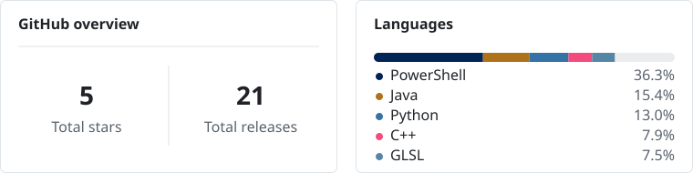

<!-- markdownlint-disable MD013 MD033 MD041 -->

  <picture>
    <source media="(max-width: 600px)" srcset="./assets/profile/header/mobile.svg">
    
  </picture>

## Building now

<!-- building_now:start -->
- [**Yusseter**](https://github.com/Yusseter/Yusseter) — Yusseter's profile repository. 
  <blockquote>Updated <relative-time datetime="2026-09-29T20:09:49Z">Sep 29, 2026</relative-time> · <a href="https://github.com/Yusseter?tab=repositories&amp;language=python"><picture><source media="(prefers-color-scheme: light) and (max-width: 600px)" srcset="./assets/profile/generated/languages/light/mobile/python.svg"><source media="(prefers-color-scheme: dark) and (max-width: 600px)" srcset="./assets/profile/generated/languages/dark/mobile/python.svg"><source media="(prefers-color-scheme: light)" srcset="./assets/profile/generated/languages/light/desktop/python.svg"><source media="(prefers-color-scheme: dark)" srcset="./assets/profile/generated/languages/dark/desktop/python.svg"></picture>Python</a></blockquote>
<!-- building_now:end -->

## Recent commits

<!-- recent_commits:start -->
- [**Yusseter**](https://github.com/Yusseter/Yusseter) — [Update profile header styling](https://github.com/Yusseter/Yusseter/commit/7c4ff542397b6a41d3dbed551c60c8f287953ea0) 
  <blockquote>Committed <relative-time datetime="2026-09-29T20:09:49Z">Sep 29, 2026</relative-time> · [&nbsp;7c4ff54](https://github.com/Yusseter/Yusseter/commit/7c4ff542397b6a41d3dbed551c60c8f287953ea0)</blockquote>
- [**Yusseter**](https://github.com/Yusseter/Yusseter) — [Add configurable profile header backgrounds](https://github.com/Yusseter/Yusseter/commit/5a1edca6b237f52ff4d2473d87ed5e1f192230a1) 
  <blockquote>Committed <relative-time datetime="2026-09-29T20:09:10Z">Sep 29, 2026</relative-time> · [&nbsp;5a1edca](https://github.com/Yusseter/Yusseter/commit/5a1edca6b237f52ff4d2473d87ed5e1f192230a1)</blockquote>
- [**Yusseter**](https://github.com/Yusseter/Yusseter) — [Sync all background SVG variants safely](https://github.com/Yusseter/Yusseter/commit/57c3a5da420ce99676d09847d9e44b3132b6fd02) 
  <blockquote>Committed <relative-time datetime="2026-09-28T20:17:24Z">Sep 28, 2026</relative-time> · [&nbsp;57c3a5d](https://github.com/Yusseter/Yusseter/commit/57c3a5da420ce99676d09847d9e44b3132b6fd02)</blockquote>
- [**Yusseter**](https://github.com/Yusseter/Yusseter) — [Add outlined eagle background variants](https://github.com/Yusseter/Yusseter/commit/307300473c6c725278147d1412f80515fce65604) 
  <blockquote>Committed <relative-time datetime="2026-09-28T19:58:13Z">Sep 28, 2026</relative-time> · [&nbsp;3073004](https://github.com/Yusseter/Yusseter/commit/307300473c6c725278147d1412f80515fce65604)</blockquote>
- [**Yusseter**](https://github.com/Yusseter/Yusseter) — [Make release title include badge in one link](https://github.com/Yusseter/Yusseter/commit/60852cb2388f4ea6202db787be1c12abf1a77bd3) 
  <blockquote>Committed <relative-time datetime="2026-09-24T19:18:57Z">Sep 24, 2026</relative-time> · [&nbsp;60852cb](https://github.com/Yusseter/Yusseter/commit/60852cb2388f4ea6202db787be1c12abf1a77bd3)</blockquote>
<!-- recent_commits:end -->

## Recent releases

<!-- recent_releases:start -->
- [**Tray Order Lock 0.2.0**&nbsp;](https://github.com/Yusseter/tray-order-lock/releases/tag/v0.2.0) 
  <blockquote>Released <relative-time datetime="2026-08-28T11:31:20Z">Aug 28, 2026</relative-time> · [&nbsp;v0.2.0](https://github.com/Yusseter/tray-order-lock/tree/v0.2.0)</blockquote>
- [**test**&nbsp;](https://github.com/Yusseter/Minecraft-Yusseter-s-Vanilla-Resource-Pack/releases/tag/test) 
  <blockquote>Released <relative-time datetime="2026-08-20T14:03:25Z">Aug 20, 2026</relative-time> · [&nbsp;test](https://github.com/Yusseter/Minecraft-Yusseter-s-Vanilla-Resource-Pack/tree/test)</blockquote>
- [**CK3 Workshop Auto Updater v0.3.1**&nbsp;](https://github.com/Yusseter/ck3-workshop-auto-updater/releases/tag/v0.3.1) 
  <blockquote>Released <relative-time datetime="2026-08-19T15:55:31Z">Aug 19, 2026</relative-time> · [&nbsp;v0.3.1](https://github.com/Yusseter/ck3-workshop-auto-updater/tree/v0.3.1)</blockquote>

More releases

- [**CK3 Workshop Auto Updater v0.3.0**](https://github.com/Yusseter/ck3-workshop-auto-updater/releases/tag/v0.3.0) 
  <blockquote>Released <relative-time datetime="2026-08-07T09:23:12Z">Aug 7, 2026</relative-time> · [&nbsp;v0.3.0](https://github.com/Yusseter/ck3-workshop-auto-updater/tree/v0.3.0)</blockquote>
- [**Tray Order Lock 0.1.0**](https://github.com/Yusseter/tray-order-lock/releases/tag/v0.1.0) 
  <blockquote>Released <relative-time datetime="2026-08-05T19:40:24Z">Aug 5, 2026</relative-time> · [&nbsp;v0.1.0](https://github.com/Yusseter/tray-order-lock/tree/v0.1.0)</blockquote>
- [**CK3 Workshop Auto Updater v0.2.0**&nbsp;](https://github.com/Yusseter/ck3-workshop-auto-updater/releases/tag/v0.2.0) 
  <blockquote>Released <relative-time datetime="2026-08-05T11:08:17Z">Aug 5, 2026</relative-time> · [&nbsp;v0.2.0](https://github.com/Yusseter/ck3-workshop-auto-updater/tree/v0.2.0)</blockquote>
- [**CK3 Workshop Auto Updater v0.1.1**&nbsp;](https://github.com/Yusseter/ck3-workshop-auto-updater/releases/tag/v0.1.1) 
  <blockquote>Released <relative-time datetime="2026-08-05T10:06:18Z">Aug 5, 2026</relative-time> · [&nbsp;v0.1.1](https://github.com/Yusseter/ck3-workshop-auto-updater/tree/v0.1.1)</blockquote>
- [**CK3 Workshop Auto Updater v0.1.0**&nbsp;](https://github.com/Yusseter/ck3-workshop-auto-updater/releases/tag/v0.1.0) 
  <blockquote>Released <relative-time datetime="2026-08-03T12:43:57Z">Aug 3, 2026</relative-time> · [&nbsp;v0.1.0](https://github.com/Yusseter/ck3-workshop-auto-updater/tree/v0.1.0)</blockquote>

<!-- recent_releases:end -->

## GitHub snapshot

<!-- snapshot:start -->

  <picture>
    <source media="(max-width: 600px)" srcset="./assets/profile/generated/snapshot/mobile.svg">
    
  </picture>

<!-- snapshot:end -->
